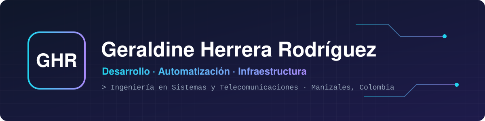

# 👋 ¡Hola! Soy Geraldine

Soy **Tecnóloga en Análisis y Desarrollo de Sistemas de Información** (SENA) y estudiante de sexto semestre de **Ingeniería en Sistemas y Telecomunicaciones** en la Universidad de Manizales.

Me gusta construir herramientas que resuelven problemas reales. En mi trabajo he desarrollado aplicaciones en **Python** y automatizaciones con **PowerShell**, **Excel** y **macros** que convierten procesos manuales de horas en tareas de minutos. Además de programar, tengo más de 3 años de experiencia en **soporte e infraestructura**, lo que me da una visión completa de la tecnología: desde el servidor hasta la persona que usa el sistema.

📍 Manizales, Colombia · 💬 Pregúntame sobre automatización, Python o bases de datos.

\---

## 🎯 Tecnologías que más uso

!\[HTML5]
!\[CSS]
!\[JavaScript]
!\[Python]
!\[SQL]
!\[PowerShell]
!\[VBA]

## 📊 Datos y análisis

!\[Excel]

!\[Power BI]

## 🔀 Control de versiones

!\[Git]

!\[GitHub]
!\[GitLab]

## 🖥️ También trabajo con

!\[Windows Server]
!\[Linux]

!\[Proxmox]
!\[pfSense]
!\[Microsoft 365]
!\[GLPI]

\---

## 🚀 Proyectos

|Proyecto|Descripción|Tecnologías|
|-|-|-|
|🗂️ **Aplicativo de radicación de EPS**|Automatiza la radicación de cuentas médicas: creación masiva de carpetas, unión de PDF, extracción de datos para renombrar archivos y procesamiento con Word. Desarrollado para Vivessalud Eje Cafetero.|Python|
|📤 **Cargue masivo de desprendibles de pago**|Envía de forma automática y segura los desprendibles de nómina mediante el protocolo FTPS.|Python, FTPS|
|🛠️ **Mesa de ayuda GLPI**|Implementación de una mesa de ayuda para la gestión centralizada de incidencias y solicitudes bajo buenas prácticas de ITIL.|GLPI, ITIL|
|🌐 **Hoja de vida en HTML**|Sitio de tres páginas desarrollado con una rama de Git por sección e integrado en master.|HTML5, Git|
|🌿 **Taller de Git colaborativo**|Simulación de trabajo en equipo con dos usuarios: llaves SSH, ramas, reversiones y fusiones.|Git, GitLab|

\---

## 🌱 Lo que estoy aprendiendo

* 🎓 Avanzando en mi carrera de Ingeniería en Sistemas y Telecomunicaciones.
* 🌐 Profundizando en **redes y telecomunicaciones**, el área en la que quiero especializarme.
* 🗣️ Fortaleciendo mi inglés (nivel B2 en curso).

\---

## 📫 Contacto

[!\[G](https://img.shields.io/badge/Gmail-D14836?style=for-the-badge&logo=gmail&logoColor=white)mail: geraldineherrerarod@gmail.com

## 

